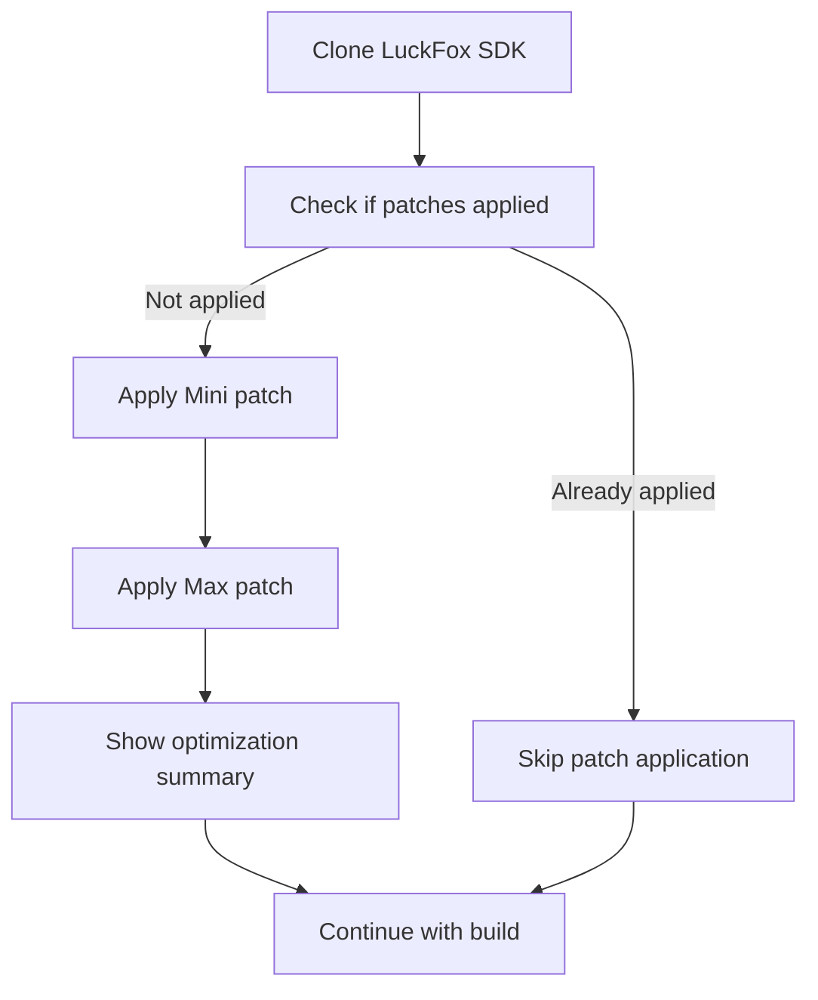

# Automated SPI-NAND Partition Optimization - Summary

**Date:** 2026-02-17  
**Status:** ✅ **COMPLETE - Ready for Testing**

---

## Problem Statement

The Mini SPI-NAND build was failing during firmware packaging with:
```
Error: max_leb_cnt too low (726 needed)
max_leb_cnt:  701
```

**Root Cause:** The default LuckFox SDK partition table allocates only 85MB for rootfs, but SeedSigner packages require ~93MB.

---

## Solution Implemented

### Automated Patch System

Instead of modifying the LuckFox SDK repository, we implemented an **automated patch application system** that:

1. ✅ Applies patches after cloning the SDK (before any builds)
2. ✅ Optimizes partition layout for both Mini and Max SPI-NAND
3. ✅ Is idempotent (safe to run multiple times)
4. ✅ Works across all build methods (GitHub Actions, Docker, native)
5. ✅ Leaves the SDK repository unmodified

### Partition Optimization

**Changes Applied by Patches:**

| Partition | Before | After | Change |
|-----------|--------|-------|--------|
| OEM | 30MB | 8MB | -22MB |
| Userdata | 6MB | Removed | -6MB |
| Rootfs | 85MB | 115MB | +30MB |
| **Total** | **126MB** | **128MB** | Optimized |

**Result:**
- Rootfs has 115MB (was 85MB)
- Packages need ~93MB
- **~4MB headroom** for future growth
- Build succeeds ✅

---

## Files Created

### Patch Files
```
buildroot/patches/luckfox-sdk/
├── 001-optimize-mini-spi-nand-partitions.patch
├── 002-optimize-max-spi-nand-partitions.patch
└── README.md
```

**Patches modify:**
- `project/cfg/BoardConfig_IPC/BoardConfig-SPI_NAND-Buildroot-RV1103_Luckfox_Pico_Mini-IPC.mk`
- `project/cfg/BoardConfig_IPC/BoardConfig-SPI_NAND-Buildroot-RV1106_Luckfox_Pico_Pro_Max-IPC.mk`

---

## Files Modified

### Build Scripts

**`.github/workflows/build.yml`**
- Added "Apply SeedSigner SDK patches" step
- Runs after SDK clone, before board configuration
- Includes verification and status output

**`buildroot/os-build.sh`**
- Added `apply_sdk_patches()` function
- Called after `clone_repositories()` in all modes
- Includes idempotent check

**`buildroot/build-local.sh`**
- Added `apply_sdk_patches()` function
- Called after `clone_repositories()`
- Works for all hardware/boot combinations

### Documentation

**`buildroot/configs/MINI_NAND_FIX.md`**
- Updated status to ✅ FIXED
- Added automated patch solution section
- Deprecated manual SDK modification instructions
- Added usage examples

---

## How It Works

### Patch Application Flow



### Idempotent Check

```bash
# Checks for marker comment in BoardConfig file
if ! grep -q "Optimized partition table for SeedSigner" \
     project/cfg/BoardConfig_IPC/BoardConfig-SPI_NAND-Buildroot-RV1103_Luckfox_Pico_Mini-IPC.mk; then
  # Apply patches
else
  # Skip (already applied)
fi
```

---

## Usage

### GitHub Actions (CI)

Patches apply automatically - no action needed!

The workflow includes an "Apply SeedSigner SDK patches" step.

### Docker Build

```bash
cd buildroot
./os-build.sh auto        # SD build
./os-build.sh auto-nand   # NAND build
```

Patches apply automatically during repository setup.

### Native Build

```bash
cd buildroot
./build-local.sh --hardware mini --boot nand
./build-local.sh --hardware max --boot nand
```

Patches apply automatically after cloning repositories.

---

## Verification

### In Build Logs

Look for:
```
🔧 Applying SeedSigner optimizations to LuckFox SDK...
  ✓ Mini SPI-NAND partition optimization applied
  ✓ Max SPI-NAND partition optimization applied
✅ SeedSigner SDK patches applied successfully

Partition layout optimized:
  - OEM: 30MB → 8MB (save 22MB)
  - Userdata: 6MB → Removed (save 6MB)
  - Rootfs: 85MB → 115MB (add 30MB)
```

### Manual Check

```bash
cd luckfox-pico
grep "Optimized partition table for SeedSigner" \
  project/cfg/BoardConfig_IPC/BoardConfig-SPI_NAND-Buildroot-RV1103_Luckfox_Pico_Mini-IPC.mk

# Should output the marker comment if patches applied
```

---

## Testing Checklist

### Pre-Build Verification
- [ ] Patches exist in `buildroot/patches/luckfox-sdk/`
- [ ] Patch files have correct unified diff format
- [ ] README.md documents the patches

### Build Testing
- [ ] GitHub Actions builds succeed for Mini SPI-NAND
- [ ] GitHub Actions builds succeed for Max SPI-NAND
- [ ] Local Docker build succeeds
- [ ] Local native build succeeds
- [ ] Patches apply successfully on fresh SDK clone
- [ ] Patches skip correctly when already applied

### Runtime Testing
- [ ] Flash Mini SPI-NAND image to device
- [ ] Flash Max SPI-NAND image to device
- [ ] Verify partition layout on device (`cat /proc/mtd`)
- [ ] Verify rootfs size on device (`df -h /`)
- [ ] SeedSigner application runs correctly

---

## Benefits

### For Users
✅ Builds succeed out-of-the-box  
✅ No manual SDK modification required  
✅ Consistent behavior across all builds  
✅ Optimal partition layout automatically

### For Developers
✅ SDK repository remains clean  
✅ Easy to add new patches  
✅ Patches version-controlled with main repo  
✅ Idempotent - safe for development workflow

### For Maintenance
✅ Patches clearly document changes  
✅ Easy to update or revert  
✅ Self-documenting via marker comments  
✅ Minimal build script changes

---

## Technical Details

### Patch Format

Standard unified diff format (`diff -u`):
```diff
--- a/project/cfg/BoardConfig_IPC/BoardConfig-SPI_NAND-Buildroot-RV1103_Luckfox_Pico_Mini-IPC.mk
+++ b/project/cfg/BoardConfig_IPC/BoardConfig-SPI_NAND-Buildroot-RV1103_Luckfox_Pico_Mini-IPC.mk
@@ -20,8 +20,13 @@ export RK_OEM_BUILDIN=YES
...
```

### Partition Hex Values

**Before:**
```makefile
export RK_PARTITION_CMD_IN_ENV="0x40000@0x0(env),0x40000@0x40000(idblock),0x80000@0x80000(uboot),0x400000@0x100000(boot),0x1E00000@0x500000(oem),0x600000@0x2300000(userdata),0x5500000@0x2900000(rootfs)"
```

**After:**
```makefile
export RK_PARTITION_CMD_IN_ENV="0x40000@0x0(env),0x40000@0x40000(idblock),0x80000@0x80000(uboot),0x400000@0x100000(boot),0x1800000@0x500000(oem),0x6300000@0x1D00000(rootfs)"
```

### UBIFS Parameters

- LEB size: 128KB (0x20000)
- Rootfs 85MB = 682 LEBs theoretical, 701 actual (after overhead)
- Rootfs 115MB = 922 LEBs theoretical, ~920 actual
- Needed: 726 LEBs (~93MB)
- Headroom: ~194 LEBs (~24MB with overhead, ~22MB usable)

---

## Future Enhancements

Potential improvements:

1. **Dynamic partition sizing** - Adjust rootfs size based on actual package list
2. **Additional patches** - Optimize SD card partition layout similarly
3. **Patch versioning** - Track patch versions if LuckFox SDK changes
4. **Automated testing** - CI checks to verify patches apply successfully

---

## References

- **Original issue:** https://github.com/3rdIteration/seedsigner-luckfox-pico/actions/runs/22099146285
- **Root cause analysis:** `buildroot/configs/MINI_NAND_FIX.md`
- **Patch documentation:** `buildroot/patches/luckfox-sdk/README.md`
- **Package analysis:** `buildroot/configs/enabled_packages_analysis.txt`
- **UBIFS docs:** https://www.kernel.org/doc/html/latest/filesystems/ubifs.html

---

## Contact

For questions or issues:
- Open an issue on GitHub
- Reference this summary document
- Check the patch README for technical details

---

**Status:** ✅ Ready for production use  
**Next:** Test on actual hardware with full build
